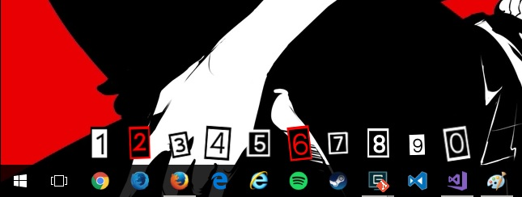

# winmetabar
This is a small windows utility that shows number label above task bar icons so you can use `Win + <Number Key>` to launch them easily.

# Installation
* Install Visual Studio 2017.
* Clone this repository. 
* Build it.
* `Win + R` to launch the Run box, and enter `shell:startup` to open the startup folder. 
* Find the `winmetabar.exe` from the build folder and copy it to the startup folder.
* Log out and log back in, the app should be started automatically.

# Uninstall
* Find and kill `winmetabar.exe` from task manager
* `Win + R` to launch the Run box, and enter `shell:startup` to open the startup folder. 
* Delete the `winmetabar.exe` from the startup folder.

# Usage
* Press Win key and the number icons should show above the task bar icons.
* To replace the default number icons, you can either
  * Replace the `numbers100ransom.png` with your own one (the easy way) or.
  * Add another image to the resource and update the resource ID in `config.h` (the right way).
